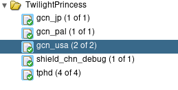

The **decompiler** is the most helpful tool when it comes to reverse engineering. Whether you're decompiling code or working on documentation, you will need to set up the decompiler to progress.

:::info Decompiler
The decompiler is a program that translates assembly instructions into pseudocode (code that attempts to look like source code).
:::

The pseudocode emitted by the decompiler is often times not completely accurate or compilable code, but it can give you a much better idea of what the assembly code is doing. Using this pseudocode, you can clean it up and attempt to turn it into accurate and compilable code.

The decompiler we will be using is **Ghidra**. With Ghidra, we have a shared project database that allows you to view any version of TP in Ghidra.

To access the shared Ghidra project, we will first start with setting up a new user account for the Ghidra server.

## Setting up a Ghidra account

1. To create a new Ghidra server user, first go to the [TP Ghidra Server Repository](https://github.com/zsrtp/tp-ghidra-server) and fork it 

2. In your fork, edit the `users.yaml` file and add your desired username / permissions. If you're unsure of what permissions to choose, use `read-only`. If you require write access, contact Pheenoh or Taka to ask permission.

3. Open a pull request to the main repository so that an admin can approve and merge it. At this point, your user account is set up.

The default password of the new user will be `changeme` and will expire after 24 hours. After your first login, you will be prompted to change your password. If you have issues logging into your account, contact **Pheenoh** to reset your password. 

## Setting Up Ghidra

1. To use Ghidra, you will need to first install JDK. Install one of the [OpenJDK 17](https://adoptium.net/de/temurin/releases/) versions depending on the platform you use and follow the installation wizard.

2. Download [Ghidra 10.2.2](https://github.com/NationalSecurityAgency/ghidra/releases/download/Ghidra_10.2.2_build/ghidra_10.2.2_PUBLIC_20221115.zip). The version used is important, as incompatible versions will not be able to load the Ghidra project.

:::info Note
Alternatively, you can use the [custom Ghidra builds](https://rootcubed.dev/ghidra_builds/) created by `RootCubed`. They feature a few changes suited to GameCube decompilation that are not implemented in the main Ghidra builds yet.
:::

3. Extract the zip-file and launch Ghidra by either running `./ghidraRun` inside a terminal or executing `ghidraRun.bat` (if you are on Windows).

4. Download the [Ghidra-GameCube-Loader](https://github.com/Cuyler36/Ghidra-GameCube-Loader/releases/download/1.1.5_1/GameCubeLoader-1.1.5-6410e2f-Ghidra_10.2.2.zip) and follow the [Installation Instructions](https://github.com/Cuyler36/Ghidra-GameCube-Loader/blob/master/README.md) in the README. (Ensure that the loader version is compatible with your Ghidra version.)

5. After opening Ghidra and activating the Ghidra-GameCube-Loader, go to `File -> New Project...`. Click on `Shared Project` and use the information below in order to login with your new user. After logging in, change your password as prompted.
```
hostname:  ghidra.tpgz.io
port:      13100
username:  <your_username>
password:  changeme
```

You should now be able to view the available projects



You will want to checkout `tp_gcn_usa_1.0` for working on decompilation. We also highly recommend checking-out `tp_shield_chn_debug_new` as it offers much more insight into the code through debug strings, less aggressive function inlining, and extra debug tools.

## Using Ghidra

After opening a Ghidra project, you'll see a few different windows.


- **Decompile**: This is where the pseudocode is shown for a selected function.

- **Listing**: This is where you will see the assembly code or data located at the specified address.

- **Program Trees**: A list of the data sections within the program. Double-clicking a section will take you to that section in the Listing window.

- **Symbol Tree**: This allows you to search for and edit symbols such as function signatures and namespaces.

- **Data Type Manager**: This allows you to search for and edit data types.

### Keyboard shortcuts

#### General
- Press <kbd>Ctrl</kbd>+<kbd>Shift</kbd>+<kbd>E</kbd> to bring up the `Program Text` search.
- Press <kbd>G</kbd> to bring up the `Go To` window, where you can directly go to a specified memory address.

#### Decompiler
- Press <kbd>L</kbd> while highlighting a function name or data to bring up the `Rename` window.
- Press <kbd>Ctrl</kbd>+<kbd>L</kbd> while highlighting data to bring up the `Data Type Chooser` window.

#### Listing
- Press <kbd>T</kbd> while highlighting data to bring up the `Data Type Chooser` window.
- Press <kbd>[</kbd> while highlighting data to create an array.
- After having changed the data type of some data, Press <kbd>Y</kbd> while highlighting data to change it to the last used data type.

### Tutorial
Here is a tutorial by Taka going over the basics of using Ghidra to setup data structures.
<iframe height="315" width="560" src="https://www.youtube.com/embed/fMQ_Thv93Ws" allowfullscreen="true"/>

## Problems?

You can always ask for help on the [Zelda Decompilation Discord server](https://discord.zelda64.dev/) in the #tp-decomp channel!