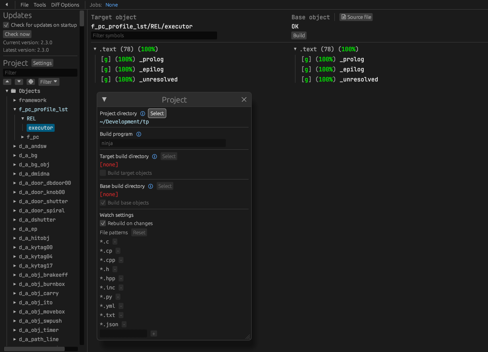

Follow these steps to set up the project.

## Setting up dependencies
### Windows

- Install [Python 3.10 or newer](https://www.python.org/downloads/) and add it to `%PATH%`
- Download [ninja](https://github.com/ninja-build/ninja/releases) and add it to `%PATH%`
  - Quick install via pip: `pip install ninja`

### macOS

- Install [ninja](https://github.com/ninja-build/ninja/wiki/Pre-built-Ninja-packages):

  ```sh
  brew install ninja
  ```

- Install [wine-crossover](https://github.com/Gcenx/homebrew-wine):

  ```sh
  brew install --cask --no-quarantine gcenx/wine/wine-crossover
  ```

After OS upgrades, if macOS complains about `Wine Crossover.app` being unverified, you can unquarantine it using:

```sh
sudo xattr -rd com.apple.quarantine '/Applications/Wine Crossover.app'
```

### Linux

- Install [ninja](https://github.com/ninja-build/ninja/wiki/Pre-built-Ninja-packages).
- For non-x86(_64) platforms: Install wine from your package manager.
  - For x86(_64), [wibo](https://github.com/decompals/wibo), a minimal 32-bit Windows binary wrapper, will be automatically downloaded and used.

## Setting Up The Repository

- Clone the repository:

  ```sh
  git clone https://github.com/zeldaret/tp.git
  ```

- Copy your game disc image to `orig/GZ2E01`.
  - Supported formats: ISO (GCM), RVZ, WIA, WBFS, CISO, NFS, GCZ, TGC.
  - After the initial build, the disc image can be deleted to save space.

- Configure:

  ```sh
  python configure.py
  ```

  To use a version other than `GZ2E01` (USA), specify it with `--version`.
- Build:

  ```sh
  ninja
  ```

## Setting up Objdiff

Objdiff is the tool we use to compare our compiled code to the expected original code.

Download the latest release from [encounter/objdiff](https://github.com/encounter/objdiff). Under project settings, set `Project directory`. The configuration should be loaded automatically.

Select an object from the left sidebar to begin diffing. Changes to the project will rebuild automatically: changes to source files, headers, `configure.py`, `splits.txt` or `symbols.txt`.



## Problems?

Feel free to ask for help on the [Zelda Decompilation Discord server](https://discord.zelda.deco.mp/) in the `#tp-decomp-help` channel!